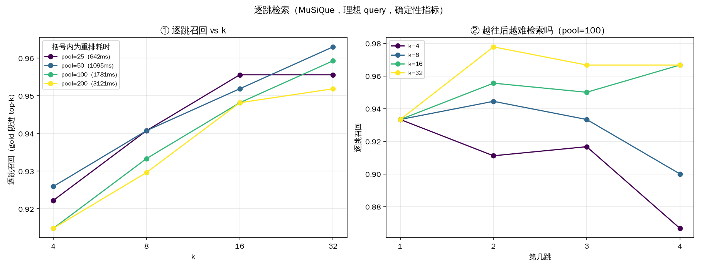

# 混合检索 RAG · agentic 多跳 · **可证伪的评测**

> 一条生产级 RAG 检索栈 + 两条 agentic 控制流 + 一套**尺子先自证中立**的评测装置。
>
> **召回**（BM25 + bge 稠密向量，RRF 融合）→ **重排**（bge-reranker 交叉编码）
> → **多跳**（react 自主循环 / planner 显式链条）→ **评测**（三个头号量，各有各的参照系）。
>
> 重点不在"分更高"，在**每个数字都知道自己是怎么来的、能不能被推翻**。
> 全部实验的设置 / 命令 / 原始数据 / 被推翻的条目在 **[EXPERIMENTS.md](EXPERIMENTS.md)**。

---

## 〇、八道题、八条完整链路（每种题型各一条真实记录）

从主评测的逐题 dump 里，**每种题型各挑一道**。
下面的 query 序列、每次检索**新落地的 gold**、引用句、答案、裁判理由**全部原样抄自 dump**，
`example_id` 可 grep 回 `runs/dumps/final_musique_judged.jsonl` / `final_mhrag{,_judged}.jsonl` 复核。

> 配置：`gpt-5.6-luna` / react / pool=50 / k=8 —— 与 §1 是**同一批运行**，不是单独跑的演示。
> ⚠️ **这是最好的一档，不是平均水平**（平均在 §1.1：4hop 0.633、2hop 0.667）。
> 看点也不在"答对了"，在**第 k 次 query 里出现的实体，只有第 k−1 次检索能给它** —— 这才是多跳的可证伪标志（§6.1）。

**怎么读下面的数**：`累计召回 x/N` 是每次检索后 gold 证据的累计覆盖（dump 的 `curve` 字段，
相邻两项之差 = 那一跳的边际贡献）；**第 1 次检索拿到的那部分就是单发检索的上限，剩下的是多跳挣来的**。

### 〇.1 `1hop` · MuSiQue · 一次检索、一句引用

```text
Q     Who founded Australia's liberal party?
gold  Robert Menzies

↳ 检索 #1  query = "Australia's Liberal Party founded founder who founded Liberal Party of Australia"
           top-8 → Liberal Party of Australia ×4 / History of Australia / Political party / …
           ✔ 新落地 gold#1        累计召回 1/1

引用   "The party's founder and longest-serving leader Robert Menzies envisaged that
        Australia's middle class would form its main constituency."
答案   Australia's Liberal Party was founded by **Robert Menzies**.
裁判   correct 1 · grounded 1 · sufficient 1
       "The answer matches the gold answer, is directly supported by the retrieved passage,
        and the cited sentence fully establishes the answer."
```

`1 次检索 · 0.63 万字符 · 引用 1 句（100% 可回溯）· delivered 1/1` ｜ `example_id: 1hop__2hop__29368_29376`

### 〇.2 `2hop` · MuSiQue · 桥接实体只能由上一跳给

```text
Q     Who does the author of Home: A Memoir of My Early Years play in Princess Diaries?
gold  Queen dowager Clarisse Renaldi        （gold 链：memoir → Julie Andrews → 她演的角色）

↳ 检索 #1  query = '"Home: A Memoir of My Early Years" author'
           top-8 → Home: A Memoir of My Early Years / Home (Robinson novel) / …
           ✔ 新落地 gold#1        累计召回 1/2
↳ 检索 #2  query = 'Julie Andrews role in The Princess Diaries played'
                     ^^^^^^^^^^^^ 这个名字只有 #1 能给 —— 原问句里没有
           top-8 → The Princess Diaries (film) / Eloise at Christmastime / …
           ✔ 新落地 gold#2        累计召回 2/2

引用   "Home: A Memoir of My Early Years is a best-selling memoir written by Julie Andrews."
       "It stars Anne Hathaway … ruled by her grandmother Queen dowager Clarisse Renaldi (Julie Andrews)."
答案   Julie Andrews plays **Queen Dowager Clarisse Renaldi**, Mia Thermopolis's grandmother,
       in *The Princess Diaries*. [source: The Princess Diaries (film)]
裁判   correct 1 · grounded 1 · sufficient 1
```

`2 次检索 · 0.89 万字符 · 引用 2 句 · delivered 2/2 · 第 1 次检索只够到 1/2` ｜ `example_id: 2hop__761291_87295`

### 〇.3 `3hop` · MuSiQue · 桥接实体连传两跳

```text
Q     Who is the owner of the record label of the performer of Groovy Little Summer Song?
gold  Warner Music Group     （gold 链：歌 → James Otto → Warner Bros. → Warner Music Group）

↳ 检索 #1  query = '"Groovy Little Summer Song" performer'
           ✔ 新落地 gold#1        累计召回 1/3
↳ 检索 #2  query = 'James Otto record label Shake What God Gave Ya label owner Warner Bros. Nashville'
                     ^^^^^^^^^^ 来自 #1
           ✔ 新落地 gold#2 gold#3  累计召回 3/3
↳ 检索 #3  query = 'Warner Bros. Nashville owner parent company Warner Music Group'
                     ^^^^^^^^^^^^^^^^^^^^ 来自 #2（复核母公司，无新增 gold）
↳ 检索 #4  query = 'Warner Music Group owner owned by Access Industries'   （再往上追一层，无新增）

引用   'Groovy Little Summer Song" is a song co-written recorded by American country music artist
        James Otto.'   ← dump 原样（agent 抄证据时漏了左引号，`cited_grounded` 的宽松匹配放过了它）
       "Shake What God Gave Ya … was released in the United States on September 14, 2010 through Warner Bros. Nashville."
       "Warner Bros. Records Parent company Warner Music Group"
答案   The owner/parent company of James Otto's record label is **Warner Music Group**. …
       [source: Groovy Little Summer Song; Shake What God Gave Ya; Warner Records]
裁判   correct 1 · grounded 1 · sufficient 1 —— "答案正确，所有信息均有出处，引用的三句话完整支撑答案。"
```

`4 次检索 · 1.83 万字符 · 引用 3 句 · delivered 3/3 · 第 1 次检索只够到 1/3` ｜ `example_id: 3hop1__285585_538202_84283`

### 〇.4 `4hop` · MuSiQue · **每跳各拿一条 gold，累计召回逐跳爬满**

```text
Q     Who won more national championships between the university featuring Fort Hill and the
      university of the state where Edwards won the primary besides the state where the
      Richmond Braves moved?
gold  University of South Carolina

↳ 检索 #1  query = 'Fort Hill university campus university featuring Fort Hill'
           top1 → Fort Hill (Clemson, South Carolina)      ✔ gold#3   累计 1/4   ← 拿到 Clemson
↳ 检索 #2  query = 'Edwards won the primary state politician Edwards primary'
           top1 → 2004 United States presidential election ✔ gold#2   累计 2/4   ← 拿到 South Carolina
↳ 检索 #3  query = 'Richmond Braves moved to which state'
           top1 → Richmond, Virginia                       ✔ gold#1   累计 3/4   ← 拿到 Georgia（用于排除）
↳ 检索 #4  query = 'Clemson University national championships total'
                     ^^^^^^^ 来自 #1
           → Clemson–South Carolina rivalry                ✔ gold#4   累计 4/4
↳ 检索 #5  query = 'University of South Carolina national championships Clemson University …'
                     ^^^^^^^^^^^^^^^^^^^^^^^^^ 来自 #2，与 #1 的 Clemson 并列复核（无新增）

引用   "Fort Hill … is a National Historic Landmark on the Clemson University campus in Clemson, South Carolina."
       "The following week, John Edwards won the South Carolina primary …"
       "… the city was home to the Richmond Braves … until the franchise relocated to Georgia."
       "College comparison Clemson University University of South Carolina … National Championships 5 10"
答案   The **University of South Carolina** won more national championships—**10**, compared with
       **Clemson University's 5**. … [source: Clemson–South Carolina rivalry]
裁判   correct 1 · grounded 1 · sufficient 1
```

`5 次检索 · 3.06 万字符 · 引用 4 句 · delivered 4/4 · 第 1 次检索只够到 1/4（0.25 → 0.50 → 0.75 → 1.00 逐跳爬满）`
｜ `example_id: 4hop3__39836_29339_508306_70744`

### 〇.5 `comparison` · MultiHop-RAG · 两篇文章各取一条，答的是**差别在哪**

```text
Q     Does the Fortune article claim that SBF used Caroline Ellison as a front for secret access to
      customer funds at Alameda, while the TechCrunch article alleges that Ellison took $14 billion
      from customers to repay debts under SBF's instruction, or do both articles assert the same
      involvement …?
gold  Yes

↳ 检索 #1  query = 'Fortune article Sam Bankman-Fried Caroline Ellison front secret access customer funds Alameda Research'
           top1 → "Is Sam Bankman-Fried a bad 'man' or a good 'boy'? …"    ✔ gold#1   累计 1/2
↳ 检索 #2  query = 'TechCrunch article Caroline Ellison 14 billion customers repay debts Sam Bankman-Fried instruction'
           top1 → "SBF Trial: The latest updates from the FTX collapse's courtroom drama"  ✔ gold#2  累计 2/2
↳ 检索 #3/#4  带引号回查原文（"Using Caroline Ellison" / "took $14 billion"）—— 无新增 gold，是**自我复核**

引用   "Using Caroline Ellison … as a front, Bankman-Fried had "secret access" to customer money …"
       "… Caroline Ellison, who claimed she took $14 billion from customers to repay debts to lenders …
        under the instruction of SBF."
答案   They describe **different aspects of the same alleged misuse**: … Thus, both implicate
       Bankman-Fried, but they do not make the identical claim: Fortune emphasizes the access
       mechanism, whereas TechCrunch emphasizes the transaction and his alleged direction.
裁判   correct 1 · grounded 1 · sufficient 1
```

`4 次检索 · 1.95 万字符 · 引用 2 句 · delivered 2/2` ｜ `example_id: local-1925`

### 〇.6 `inference` · MultiHop-RAG · 四家媒体的四条线索汇到同一个主语

```text
Q     Which institution … is recognized for its influence on global financial markets, recently raised
      its main interest rate to a level not seen since 2001, and is basing future rate decisions on
      economic data while combating inflation that followed a period of booming home prices?
gold  Federal Reserve      （四条 gold 证据分散在 The Age / SMH / Fortune 的四篇里）

↳ 检索 #1  'The Age Sydney Morning Herald Fortune institution influence on global financial markets
            main interest rate highest level since 2001 economic data inflation booming home prices'
                                                              ✔ gold#1   累计 1/4
↳ 检索 #2  'site:theage.com.au Federal Reserve booming home prices inflation data interest rates 2001'
                                                              ✔ gold#3   累计 2/4
↳ 检索 #3  'site:smh.com.au Federal Reserve booming home prices inflation data interest rates 2001'
↳ 检索 #4  'site:fortune.com Federal Reserve global financial markets influence data dependent …'
                                                              累计 2/4（两次都没有新证据）
↳ 检索 #5  'Federal Reserve influence global financial markets institution reports The Age
            Sydney Morning Herald Fortune'                    ✔ gold#2   累计 3/4
↳ 检索 #6  'Federal Reserve future interest rate decisions dependent on economic data inflation
            housing boom home prices'                         ✔ gold#4   累计 4/4

引用   "…the "Fed matters more than other central banks," … BofA Global Research report"
       "The Fed's main interest rate is at its highest level since 2001 …"
       "…the Fed, which has insisted it will make upcoming decisions on interest rates based on
        what incoming data say about the economy."
       "Back then, just like today, home prices had boomed for years before Fed officials were
        ultimately forced to hike interest rates aggressively …"
答案   The institution is the **U.S. Federal Reserve (the Fed)**. …
裁判   correct 1 · grounded 1 · sufficient 1
```

`6 次检索 · 3.30 万字符 · 引用 4 句 · delivered 4/4 · 第 1 次检索只够到 1/4` ｜ `example_id: local-1962`

> ⚠️ **连最好的一条里也有浪费**：#2–#4 用了 `site:` 这种**网页搜索的写法**，而这是个本地向量库、
> 根本不认这个语法 —— 三次里只有一次带来新证据。这类空转正是 §1.1 里 `n_search` / 字符成本的来源之一，
> 也是"agent 自主控制流"要付的真实代价。

### 〇.7 `temporal` · MultiHop-RAG · 按时间顺序串三篇报道

```text
Q     After the CBSSports.com report (2023-10-12) on Taylor Swift at Arrowhead Stadium, and the
      Independent report (2023-11-25) on Travis Kelce's invitation, was the news about their
      relationship consistent with the later Independent report (2023-12-06)?
gold  Yes

↳ 检索 #1  'CBSSports.com October 12 2023 Taylor Swift activities Arrowhead Stadium Travis Kelce
            relationship'                                     ✔ gold#2   累计 1/3
↳ 检索 #2  'The Independent Life and Style November 25 2023 Travis Kelce invitation Taylor Swift'
                                                              ✔ gold#1   累计 2/3
↳ 检索 #3  'The Independent Life and Style December 6 2023 Taylor Swift Travis Kelce relationship'
↳ 检索 #4  'CBSSports.com October 12 2023 Taylor Swift Arrowhead Stadium report'
↳ 检索 #5  '"December 6, 2023" "The Independent" "Taylor Swift" "Travis Kelce" relationship'
                                                              累计 2/3（三次换写法都没够到 12-06 那条）
↳ 检索 #6  'site:independent.co.uk/life-style Taylor Swift Travis Kelce December 6 2023 relationship'
                                                              ✔ gold#3   累计 3/3
↳ 检索 #7  'The Independent Life Style December 6 Taylor Swift Travis Kelce dating couple report'
                                                              （复核，无新增）

引用   "On his podcast, he later invited the "Anti-Hero" singer to one of his games at Arrowhead
        Stadium - an invitation she famously accepted on 24 September."
       "Oct. 12: Swift attends Chiefs-Broncos"
       "By the time I went to that first game, we were a couple."
答案   Yes. The reports were consistent: Kelce invited Swift to an Arrowhead game, she accepted and
       attended, and the later report stated that they were already dating when she first attended
       his game. … The chain is: Kelce's invitation → Swift's Arrowhead attendance → later
       confirmation that they were already a couple.
裁判   correct 1 · grounded 1 · sufficient 1
```

`7 次检索 · 3.62 万字符 · 引用 3 句 · delivered 3/3 · 第 1 次检索只够到 1/3` ｜ `example_id: local-1556`

### 〇.8 `null`（不可答）· MultiHop-RAG · **查了 7 次，然后说"查不到"**

不可答题没有 gold，`correct` 对它在定义上无意义（§6.1 的坑①）。这里"答得最好"= **一次干净的拒答**：
不给候选、不编引用，还**逐条点名**哪个链接没被支持。

```text
Q     … which single letter represents both the start of the name of the Mastercard CEO who
      commented on the earnings report and the first letter of the company that Mastercard has
      entered into a new partnership with as mentioned in the Bloomberg article?
gold  Insufficient information.（语料里根本没有这两篇）

↳ 检索 #1  'CNBC Mastercard financial performance last quarter CEO commented on earnings report …'
↳ 检索 #2  'site:cnbc.com Mastercard quarterly earnings CEO comments Mastercard CEO 2024 revenue …'
↳ 检索 #3  'Bloomberg Mastercard new partnership announced this year Mastercard partnership company …'
↳ 检索 #4  'Mastercard CEO said earnings report last quarter CNBC Michael Miebach quarterly results'
                                                      ^^^^^^^^^^^^^^^ ← 这个名字**不在任何检索结果里**，
                                                      是模型自己的参数化知识；它把它当**探针**去查证，没查到
↳ 检索 #5  'Mastercard Bloomberg "new partnership" company announced 2024'
↳ 检索 #6  'Bloomberg Mastercard partnership announced this year Mastercard partner company'
↳ 检索 #7  'CNBC Mastercard earnings "CEO" "last quarter" Mastercard'
           7 次全部落空 —— 没有一条能钉住"CEO 名字"或"新合作方"

引用   （0 句 —— 没抄到就一句不写）
自曝   unsupported: ×2   ← agent 主动声明两个环节没有依据（prompts.py v3 的 escape hatch）
答案   I could not reliably determine the letter: the retrieved snippets do not identify the
       CNBC article's CEO or the Bloomberg article's new partner.
三分类 refused（不给候选）—— 见 §1.3：30 道 null 里 17 拒答 + 13 自曝存疑，**无免责断言 0/30**
```

`7 次检索 · 3.86 万字符 · 引用 0 句 · 自认没依据 2 环` ｜ `example_id: local-1114`

> **最值得看的是 #4**：模型脑子里有"Mastercard CEO = Michael Miebach"，但它没把这条参数化知识
> 写进答案，而是**发成一次检索去查证** —— 查不到，于是答案里一个字都不提。
> §1.4 里那条「不给检索、凭参数化知识答」的地板是 0.244，这道题演的就是**那 0.244 没有漏进答案**。
>
> 这也是整套评测里**最贵**的行为（null 平均 6.6 次检索 / 3.42 万字符，见 §1.1）——
> **"知道自己不知道"是要花钱买的**，而二值的"拒答率"会把这笔钱和它买到的东西一起记成失败。

---

## 一、结果

`gpt-5.6-luna` / react / **pool=50 / k=8**，8 种题型、同一套系统、同一个裁判。

### 1.1 按题型（MuSiQue 是真桥接多跳，MultiHop-RAG 已被本项目探针证伪，见 §3.2）

| 题型 | 语料 | n | **correct** | grounded | delivered† | n_search | 万字符 |
|---|---|---:|---:|---:|---:|---:|---:|
| **1hop** | MuSiQue | 30 | **0.933** | 0.933 | 1.000 | **1.33** | **0.74** |
| 2hop | MuSiQue | 30 | 0.667 | 0.883 | 0.917 | 3.17 | 1.64 |
| 3hop | MuSiQue | 30 | 0.767 | 0.739 | 0.944 | 4.07 | 2.34 |
| **4hop** | MuSiQue | 30 | **0.633** | 0.757 | 0.833 | **5.77** | **3.07** |
| inference | MultiHop-RAG | 30 | 0.967 | 0.960 | 0.719 | 3.83 | 1.93 |
| comparison | MultiHop-RAG | 30 | 0.900 | 0.867 | 0.917 | 3.23 | 1.66 |
| temporal | MultiHop-RAG | 30 | 0.800 | 0.950 | 0.639 | 4.70 | 2.49 |
| **null**（不可答） | MultiHop-RAG | 30 | 见 1.3 | — | — | **6.60** | **3.42** |

† `delivered` = gold 证据段里检索**实际给到**的比例，**确定性、零裁判噪声**。

> **同一套系统在两个数据集上差 0.2–0.3。** MultiHop-RAG 的"多跳"题得 0.80–0.97，
> MuSiQue 的 2/3/4hop 只有 0.63–0.77 —— 因为前者 99.3% 的题**光靠原问句就能够到含答案那篇**。
> ⇒ **"我的 RAG 准确率 0.89" 取决于在哪个集上测，不取决于系统。报数必须连评测集的探针结果一起报。**

### 1.2 MuSiQue 多跳的主口径

| 口径 | n | **correct** | grounded |
|---|---:|---:|---:|
| 2/3/4hop 全部题 | 90 | 0.689 | 0.844 |
| 剔除双审计员一致判坏的题 | 74 | 0.811 | 0.892 |
| **剔除坏题 + gold 未陈述关系的题** ← **主口径** | 71 | **0.831** | 0.887 |
| 同上，1–4hop 全档 | 101 | 0.861 | 0.901 |
| （激进口径：剔任一审计员判坏的题） | 55 | 0.909 | 0.927 |

**0.689 这个数是怎么被三件事压低的**（拆解见 §5.3）：

```
坏题          ~0.12   剔 16 题 → 0.689→0.811（双审计员一致，带假阳率校准）
gold 未陈述关系 ~0.02   逐条核过 gold 原文的 7 题，「答对」与「有依据」在这些题上互斥
真答错        ~0.13   correct@给了 = 0.77–0.83（它一旦开口，八成是对的）
```

### 1.3 不可答题（null）：**0/30 无免责编造**

| 行为 | n=30 | 判定 |
|---|---:|---|
| 明确拒答 | 17 | ✅ 正确 |
| 给候选但**自曝证据不支持** | 13 | ✅ 诚实（把不确定性交给用户） |
| **无免责断言** | **0** | ← 唯一的失败模式 |

> 二值的"拒答率"会把那 13 道诚实标注的记成失败，所以本项目用**三分类**（`rag/agent.py:answer_stance`）。
> ⚠️ 关键词法永远会漏（补过三轮词表），所以**同时报人工核验数**：手工逐条核过 60 道，真实 asserted = **0/60**。

### 1.4 还剩多少空间：**检索已经不是瓶颈**

| | 值 | 含义 |
|---|---|---|
| 地板（不给检索，凭参数化知识答） | 0.244 | 不是检索挣来的那部分 |
| 天花板（**同一套 agent** + gold 证据） | 0.739 | 检索做到完美也就这样 |
| **★ 检索还能买到**（天花板 − 实测） | **+0.102 [+0.011,+0.193] ✅** | 整个检索方向的**全部**剩余空间 |

⇒ **把证据喂到嘴边总共只值 +0.10，而换一个答题模型在真检索下就买到 +0.148。换模型 > 把检索做到完美。**
拆到跳数上只有 4hop 显著（**+0.200 ✅**），2hop/3hop 都跨 0。

---

## 二、检索栈：每个参数的取值都有实验撑着

**尺子**：**逐跳召回** —— 把 MuSiQue 分解里的 `#N` 换成前跳真答案，得到"这一跳该发的 query"，
问它那**唯一一段** gold 有没有进 top-k。确定性、零裁判噪声、**与链长无关**。
900 次单跳检索，同跳配对 bootstrap。（为什么不能用"一次拿全"的口径 → §2.6）

### 2.1 整栈消融：从 BM25 单路一路加到重排，**全程同一把尺**

| 层 | 逐跳召回@8 | Δ vs 上一层 | ms/跳 |
|---|---:|---:|---:|
| ① BM25 单路 | 0.830 | — | 60 |
| ② dense 单路 | 0.889 | +0.059 | 55 |
| ③ **RRF 融合** | **0.937** | **+0.048** | 55 |
| ④ minmax 融合 | 0.941 | +0.004 | 55 |
| ⑤ ③ + reranker | 0.941 | +0.000 | **1084** |

| 对照 | Δ | 95% CI |
|---|---:|---|
| **融合 − BM25 单路** | **+0.107** | **[+0.074,+0.144] ✅** |
| **融合 − dense 单路** | **+0.048** | **[+0.015,+0.081] ✅** |
| minmax − RRF | +0.004 | [−0.011,+0.022] 跨0 |

⇒ **融合是这条栈上唯一稳定显著、且几乎免费（+55ms）的收益。融合算法选哪个不重要。**

### 2.2 融合权重：**调了也白调**

| `w_bm25` | 0.00 | 0.25 | **0.50** | 0.75 | 1.00 |
|---|---|---|---|---|---|
| 逐跳召回@8 | 0.919 | 0.919 | **0.941** | 0.915 | 0.915 |

五个取值只差 0.026 且不单调。⚠️ 权重扫描平坦时结论**不是**"两条腿等价"，
而可能是**下游把上游差异抹平了** —— 所以权重要在**关掉重排**时扫才干净。

### 2.3 reranker：**值不值取决于 `k` 有多紧**

| 配置 | 不重排 | 重排 | Δ | 95% CI |
|---|---:|---:|---:|---|
| pool=50 **k=4** | 0.856 | 0.926 | **+0.070** | **[+0.033,+0.107] ✅** |
| pool=50 k=8 | 0.937 | 0.941 | +0.004 | [−0.019,+0.030] 跨0 |
| pool=200 **k=4** | 0.863 | 0.915 | **+0.052** | **[+0.015,+0.093] ✅** |
| pool=200 k=8/16 | 0.919/0.944 | 0.930/0.948 | +0.011/+0.004 | 跨0 |

**机制**：RRF 后 gold 通常已在前 8 名内，重排只在前 8 名**内部**换顺序 ——
k=8 名额够宽、换不换都装得下；k=4 名额紧，排序才决定性。

**所以它不是"要不要"，是一笔可换的账**：同等召回下 **≈1000ms GPU ⇄ 2800 上下文字符**。

| 配置 | 逐跳召回 | GPU ms/跳 | 上下文字符 |
|---|---:|---:|---:|
| 无重排 k=8 | 0.937 | **55** | ~5300 |
| 有重排 k=4 | 0.926 | 1084 | **~2500** |
| 配对差 | +0.011 **跨0** | 20× | 0.5× |

> 📌 **只在一格上测就外推会翻车**：先只测 k=8 得到"重排白花 20 倍算力"，
> 补测 k=4 后**被自己推翻**。⇒ **凡是"某组件没用"的结论，必须在该组件最该起作用的条件下复测。**

### 2.4 `pool` 与 `k`：两笔**不同的钱**

| | 是什么 | 花什么 | **定档** | 依据 |
|---|---|---|---|---|
| `pool` | 进 cross-encoder **之前**的候选数 | **GPU 算力**（逐对前向） | **50** | pool>50 召回点估计**转负**，200 要 4.9× 算力 |
| `k` | 交付给模型的片段数 | **上下文 token** + lost-in-the-middle | **8** | 4→8 **+0.019 ✅**；8→16 只 +0.011 却让上下文翻倍 |

| pool | 池内覆盖 | 重排 ms | k=4 | k=8 | k=16 | k=32 |
|---:|---:|---:|---:|---:|---:|---:|
| 25 | 0.956 | **642** | 0.922 | 0.941 | 0.956 | 0.956 |
| **50** ← 定档 | 0.967 | 1095 | 0.926 | **0.941** | 0.952 | 0.963 |
| 100 | 0.978 | 1781 | 0.915 | 0.933 | 0.948 | 0.959 |
| 200 | 0.985 | 3121 | 0.915 | 0.930 | 0.948 | 0.952 |



⚠️ **旧默认是 `pool=200 / k=32`，两个都被上面的实验推翻。** 旧值 200 来自一次
**在 `reranker=None` 下量池覆盖**的实验 —— 只问"证据进没进池子"、没问"交付没交付"。
**没有成本项的上游代理量单调随 pool 上升，永远支持「再开大一点」。**

### 2.5 切块：**默认评测集根本不切块**

| 语料 | 切块 | 方式 | 依据 |
|---|---|---|---|
| **MuSiQue（默认）** | **不切** | — | 维基段落本身就是自然检索单元 |
| MultiHop-RAG | 600 / overlap 150 | **递归**（`RecursiveCharacterTextSplitter`，尊重 `\n\n`→句子→词的边界） | 1200→600 让 dense 单点自查 **56%→73%** |

- **chunk 越大** → 句子级语义被稀释（dense 自查 top1 从 300 字的 79% 掉到 1200 字的 45%）；
- **chunk 越小** → 证据句被切断，这是**发生在检索之前、不可恢复**的损失；
- **递归 vs 定长**：0.653 vs 0.645，**中性** —— 递归的价值在可读性，不在召回。

⚠️ 所以 `.env` 里的 `RAG_CHUNK_SIZE` / `RAG_CHUNK_OVERLAP` **对默认配置不生效**。
**参数写在配置里 ≠ 它在起作用。**

### 2.6 ★ 为什么尺子必须是「逐跳」的

直觉的量法是「用原问句查一次，gold 的 N 段能捞回几段」。**对多跳题这是错的靶子** ——
多跳题的构造就是要让"一次拿全"不可能。后果不是"不准"，是**结构性偏向**：
既然要一次凑齐 N 段，指标必然奖励更大的 k。实测这样量出来的网格给出
「k=32 比 k=8 高 +0.13、全部显著 ✅」—— **那不是发现，是指标的算术性质。**

换成逐跳口径后还多出一个能直接回答的问题 —— **越往后越难检索吗？不。**

| 跳位 | n | k=4 | k=8 | k=16 |
|---|---:|---:|---:|---:|
| 第 1 跳 | 90 | 0.933 | 0.933 | 0.933 |
| 第 2 跳 | 90 | 0.911 | 0.944 | 0.956 |
| 第 3 跳 | 60 | 0.917 | 0.933 | 0.950 |
| **第 4 跳** | 30 | 0.867 | 0.900 | **0.967** |

⇒ **4hop 的 0.633，失败不在"找不到"，在"想不出下一跳该问什么"。**

### 2.7 一句话

**真正花钱买到东西的只有「融合」（+0.107 ✅，几乎免费）。**
reranker 只在 k 紧时值钱、pool 开大是负收益、融合权重和算法都无所谓、切块在默认集上不生效。

---

## 三、语料与评测集

### 3.1 一条命令拉数据（clone 后即可复现）

```bash
python scripts/fetch_data.py          # MuSiQue 走 HF 缓存；MultiHop-RAG 下到 data/
```

**MuSiQue（默认）**：HF `dgslibisey/MuSiQue` 的 validation，全部候选段落去重 **21100 段**
（**含官方干扰项**——只放 gold 等于把检索题变成阅读题）、**2417 题**（2/3/4hop）。段落本身就是检索单元，**不切块**。
**1hop** 由每题第 1 步派生（同语料、同检索器、gold 段精确），作难度轴的下端锚点。

**MultiHop-RAG**：HF `yixuantt/MultiHopRAG` 的 `corpus.json`（609 篇新闻）+ `MultiHopRAG.json`（2556 题），
下到 `data/`；新闻是整篇，按 600/150 递归切块 → **15172 个片段**（切块参数见 §2.5）。

**这些数据分别存在哪**（三份东西，三个地方）：

| | 存哪 | 生命周期 |
|---|---|---|
| 题目 / gold 答案 / gold 证据 | **不入库**：MuSiQue 现读 HF 缓存，MultiHop-RAG 现读 `data/*.json` | 每次进程启动重新加载 |
| 稠密向量（bge） | **Chroma，持久化在 `.cache/chroma/`** | 建一次复用 |
| BM25 倒排 | **不入 Chroma**：`rank_bm25` 进程内建索引 | 每次启动重建（语料小，秒级） |

Chroma 集合按 **(模型, 语料指纹)** 命名，所以两个语料**各占一个集合、互不混用**：
MuSiQue → `dense_b15f855b945b`（21100 条）、MultiHop-RAG(600/150) → `dense_6d3c935f8e12`（15172 条）；
`.cache/chroma/` 里其余集合是历次**切块参数扫描 / 换语料实验**留下的旧配置。编码结果另按 `.npy` 缓存，重建集合时免重算。

### 3.2 换数据集之前先跑探针

`python evals/eval_benchmark_probe.py`，**全确定性、不调 LLM**：

| 数据集 / 子集 | ⚑**捷径率** | 一次拿全 | 最高频答案占比 |
|---|---|---|---|
| MultiHop-RAG | **99.3%** | 76.5% | 34.5% |
| HotpotQA bridge | **96.5%** | 95.7% | 0.4% |
| MuSiQue 2/3/**4hop** | 79.6 / 81.8 / **69.0%** | 78.6 / 58.3 / **33.3%** | 0.8 / 4.0 / 12.1% |

⚑ 捷径率 = 光靠**原问句**就够到了**含答案那篇** → 中间的跳可以整个跳过。
**连"名字是 bridge"也不可信。换数据集前先跑探针，别看名字。**

### 3.3 坏题名单（`evals/blocklist_musique.json`，入库可复核）

1. **两个不同网关的模型各审一遍**，都判坏才进 `consensus_bad`(16)，任一判坏进 `any_bad`(33)；
   "有多个正确答案"单列 `multi_answer`(10) —— 它是**判分口径**问题，不是坏题。
2. **审计器自己先被校准**：手工核过 9 坏 + 6 好作种子。第一版召回 100% 但**假阳 67%**
   （把"多答案"当"坏题"），改判据后 → 召回 78% / **假阳 17%**。
3. **查循环论证**：审题模型 ≠ 被测答题模型。用第三个模型交叉审 → 没有自我抬高。
4. `gold_not_stated`(7)：**gold 段未陈述问句所问的那条关系**（含答案实体 ≠ 陈述了关系）。
   逐条核过原文，其中 4 题双审计员也独立判坏 —— 人工与自动一致。
5. 两审计员 Jaccard 只有 **0.48** ⇒ 判定本身有主观性，所以 §1.2 报**整个口径带**。

---

## 四、快速开始

```bash
python -m venv .venv && source .venv/bin/activate && pip install -r requirements.txt
cp endpoints.example.json endpoints.json   # 模型名 → base_url + key
cp .env.example .env                       # 网关行为 + 检索旋钮
python scripts/fetch_data.py               # 拉评测集
python -m rag.llm                          # 逐个 ping 注册表里的模型

# 看一题的完整多跳过程（evals/demo_set.json 里有 9 道挑好的演示题）
python run_agentic.py "Who played the girlfriend of Alex P. Keaton's actor on Family Ties in Back to the Future?"

# 主路径：多臂矩阵 → 判分 → 参照系
python evals/run_matrix.py --per-type 30 --tag m1_ \
    --arm base   model=deepseek-v4-pro agent=react \
    --arm strong model=gpt-5.6-luna    agent=react
python evals/eval_judge.py runs/dumps/m1_strong.jsonl --baseline runs/dumps/m1_base.jsonl \
    --out runs/dumps/m1_strong_judged.jsonl
python evals/eval_ceiling.py --per-type 30 --model gpt-5.6-luna \
    --dump runs/dumps/m1_strong_judged.jsonl --oracle-dump runs/dumps/oracle_judged.jsonl

# 检索侧量具（确定性、纯本地 GPU、不花钱）
python evals/eval_hop.py --ablate          # 整栈消融
python evals/eval_hop.py                   # pool × k 逐跳网格 + 出图
python evals/eval_benchmark_probe.py       # 数据集探针
```

> `evals/demo_set.json` 的 9 道题是**演示用**，**别用它算准确率**。
> 网关 WAF 拦未知 UA → 设 `RAG_USER_AGENT`；偶发 5xx → `RAG_MAX_RETRIES` / `RAG_TIMEOUT`。

---

## 五、评测设计 ★

这是这个项目的主体。**六条规矩，每条都对应一个若不遵守就会读错的具体场景。**

### 5.1 三个头号量，三个**互不重叠**的参照系

早期三个分里有两个从**同一个** agent 可控产物（它自己写的引用）算出：
`sufficient` 是"它引的那几句够不够"、`faithful` 是"答案能否追回它引的那几句" ——
后者**引得越少越容易满分**。两者构造上拮抗，所以三版提示词只是在同一条权衡曲线上滑：

| 提示词 | 引用属实 | faithful | 真相 |
|---|---|---|---|
| v1 什么都不要求 | **0.94** | 0.524 | — |
| v2「N 跳至少 N 行引用」 | **0.77** ⛔ | 0.619 ↑ | 分涨是因为它在**编引用** |
| v3 给 `unsupported:` 出路 | 0.87 | 0.643 | 认怂环 0→0.7，但**变省也变懒** |

**修法** —— 三个量各用一个不重叠的参照系：

| 指标 | 参照系 | 怎么来 | 能被"多引/少引"操纵吗 |
|---|---|---|---|
| `correct` | **gold 答案** | 裁判 | 否 |
| `grounded` | **agent 实际检索到的全部上下文** | 裁判 | **否** |
| `delivered` | **gold 证据 ∩ 检索上下文** | **确定性**，零裁判噪声 | 否 |

**换完当场兑现**：换更强的模型让引用属实率 0.78→0.98，旧 `faithful` 一定大涨；
新 `grounded` 报的是 **+0.068、跨 0、不显著**。同一批数据，旧尺子给捷报，新尺子给零。

### 5.2 裁判分怎么打（本项目是 **LLM-as-judge**）

- **裁判模型固定**（`deepseek-v4-pro-nothinking`，`temperature=0`），与答题模型**不同**，
  且被 `__meta__` 记录；**裁判不同 = 拒绝配对**。
- 每题一次调用，同时判 `correct` / `grounded` / `sufficient`，并**逐条列出 `ungrounded_claims`**
  —— 让这个分**可审计**，而不是一个黑箱数字。
- **空答案确定性兜底归 0**，不送裁判（否则"没有论断"会被判成"忠诚度平凡为真"，**打空的题反而加分**）。
- **分辨率下限先测出来**：同一 dump 判两次 → `correct` 0.478/0.500、`grounded` 0.676/0.727
  ⇒ **n=90 下小于 0.05 的差异不要解释。**
- ⇒ **配对比较的两臂必须由同一次裁判调用判分。**跨 pass 时漂移会被整个记到自变量头上：
  查询分解那一臂"各判各的"是 **+0.080**，同 pass 只有 **+0.023** —— **3/4 是漂移**。

### 5.3 `correct` 必须拆开：**不肯答 ≠ 答错**

`correct ≈ 给答案率 × correct@给了`。两者在 correct 上都是 0、长得一样，但该调的旋钮完全不同。

| 题型 | correct | 给答案率 | correct@给了 | 拒答丢的分 | 答错丢的分 |
|---|---:|---:|---:|---:|---:|
| 1hop | 0.933 | 1.000 | 0.933 | 0.000 | 0.067 |
| 2hop | 0.667 | 0.767 | 0.826 | **0.233** | 0.133 |
| 3hop | 0.767 | 1.000 | 0.767 | 0.000 | **0.233** |
| 4hop | 0.633 | 0.733 | 0.818 | **0.267** | 0.133 |

**2hop/4hop 的主要损失是拒答，不是答错。** 再往下拆那 15 道拒答：
**8 道 gold 证据全部交付却仍拒答**、7 道确有检索缺口。逐条核过那 8 道的 gold 原文后，
7 道是 **gold 段没写那条关系**（→ `gold_not_stated`，§3.3），1 道是 agent 表述问题。

### 5.4 四个守卫

| 守卫 | 拦什么 |
|---|---|
| `cited_grounded` <0.8 | agent 在**编引用** —— 此时只作废 `sufficient`，其余照读 |
| **截断率平价** | 交付更多字符的臂更容易被截断 → `grounded` 系统性偏低。两臂截断率不等就**拒绝出这一格** |
| **`__meta__` 自动比对** | 语料/裁判不同 = 直接拒绝配对；其余差异作为「自变量」打印出来 |
| **样本量告警** | n<60 时印出"这批样本只够分辨 ±X" |

### 5.5 成本项必须和分数一起读

`n_ctx_chars` / `n_llm_calls` / `n_search` 逐题记录。
**没有成本项的指标必然奖励"塞得更多"** —— 本项目在这上面栽过四次（title 级 recall、
`context_recall_fact`、可达空间利用率的分母、池覆盖）。

### 5.6 报改动之前，先报"还剩多少空间"

```
地板 closed   不给检索，凭参数化知识答
实测 rag      现行系统
天花板 oracle 把 gold 喂给**同一套 agent**（--oracle），唯一差别是"证据从哪来"
★ 检索还能买到 = 天花板 − 实测      ← 决定"要不要继续投检索"的那个数
```

**优先看这个差，不要看比值。** 比值的分母是（天花板 − 地板），而**地板线每轮要重新生成**：
同配置重跑一次，3hop 地板从 0.400 掉到 0.214，那一档的"利用率"随之在 **0% 与 44%** 之间摆。

⚠️ **天花板两个方向都会偏**：没有干扰项（偏乐观）；gold 标注不完整（偏悲观，实测出现过利用率 118%）。

---

## 六、架构

```
rag/                      # ★ 核心，只被依赖、不依赖 evals/
├── retriever.py          # Retriever 协议 + Doc/Hit —— 换后端时上层一行不动
├── retriever_{bm25,dense,hybrid,decompose}.py
├── reranker_qwen.py      # Qwen3-Reranker-4B（对照用，非默认）
├── agent.py              # ★ ReactRunner / PlannerRunner + 拒答三分类
├── prompts.py            # react 六条策略（v3，已冻结）+ planner 三段
├── tools.py              # rag_search：暴露给模型的唯一工具
├── llm.py                # ★ 模型注册表：模型名 → base_url + key
├── runctx.py             # ★ 配置快照 + 带 __meta__ 头的 dump 读写
└── corpus_{musique,multihop}.py

evals/                    # 每个都能 python evals/xxx.py 直接跑
├── eval_agentic.py       # ★ 跑 agent + 确定性指标，边跑边落盘、--resume、--oracle
├── eval_judge.py         # ★ 头号三分 + 同题配对 95% CI
├── eval_ceiling.py       # ★ 地板 / 实测 / 天花板
├── eval_hop.py           # ★ 逐跳召回网格 + 整栈消融（确定性、纯本地）
├── eval_pool.py          # pool × k 网格（单发口径，见 §2.6 的告诫）
├── eval_rebuild.py       # 逐层重建验收
├── eval_benchmark_probe.py / audit_dataset.py / eval_ragas.py
└── archive/              # 冻结的旧脚本（附退役原因）
```

**两条 agentic 控制流**（同一个 runner 接口）：

| | **react**（默认） | **planner** |
|---|---|---|
| 多跳怎么发生 | 模型自己决定查不查/几次/何时停 | `plan → 逐跳搜 → 逐跳抽 → 合成`，**代码保证** |
| 引用从哪来 | agent 自写 `KEY EVIDENCE`（**自述**） | 从每跳 quote **确定性拼出**（控制流副产品） |
| 实测 | — | `delivered +0.196 ✅`、引用造假**结构性消除**（0.784→0.997），<br>但 `correct −0.180 ⛔`（拒答率 0.244→0.416）⇒ **不设默认** |

### 6.1 一条真实轨迹长什么样

**"它到底跳没跳"不能靠 `n_search` 这个计数判断** —— 查 3 次也可能是同一个意思换 3 种说法。
真多跳的**可证伪标志**是：**第 k 次查询里出现了第 k−1 次才拿到的桥接实体。**
所以 runner 把 agent **实际发出的 query** 记进 `queries` 字段并在 CLI 打印：

```bash
python run_agentic.py "In what region of Phu Luong's country is John Phan's birthplace located?"
```

```text
  ↳ 检索 #1  query='Phu Luong'                → 2312 字符
  ↳ 检索 #2  query='John Phan birthplace'     → 5235 字符
  ↳ 检索 #3  query='Da Nang region Vietnam'   → 2992 字符
                     ^^^^^^^ 第 2 次检索才拿到的地名
[过程] 检索 3 次 / LLM 调用 4 次 / 引用 3 句 / 认怂 0 环
```

4hop 那道更清楚 —— 桥接实体跨了两跳：

```text
  ↳ 检索 #1  query='Fort Hill university'                       ← 拿到 Clemson
  ↳ 检索 #2  query='Edwards won primary'
  ↳ 检索 #3  query='Clemson University national championships'   ← 用上了 #1 的结果
  ↳ 检索 #4  query='Richmond Braves moved'
[过程] 检索 4 次 / LLM 调用 5 次 / 引用 4 句 / 认怂 0 环
```

**LangSmith 轨迹与 experiment**：`.env` 里设 `LANGSMITH_TRACING=true`，然后

```bash
python evals/langsmith_eval.py --per-type 10 --run-per-type 5 --concurrency 2
```

会把**评测集 + 同一个 LLM-as-judge** 上传成 LangSmith 的 dataset + experiment，
一条 example 一行，点进去能看到 agent 发了哪几个 query、每次 `rag_search` 返回什么、裁判给了什么理由。

实测（8 类型 × 5 = 40 题）：`correct 0.82 / grounded 0.88 / delivered 0.87 / n_search 3.76`，
**按题型的趋势与主评测一致**（1hop 与 inference 满分、4hop 0.50、null 的 `refused_ok` 1.00，
`n_search` 从 1hop 的 1.2 次涨到 null 的 7.0 次）。

> ⚠️ **LangSmith 在这个项目里是「过程可观测性」，不是「统计口径」。**
> 所有分数来自确定性 dump + 同题配对 bootstrap（§5），trace 用来**看 agent 干了什么**、
> 定位单题失败，**不参与任何数字的计算**（这里每格只有 n=5，区间宽约 ±0.4）。
> 另外 §2 的检索栈消融**纯本地 GPU、不经过 LLM**，LangSmith 抓不到它。
>
> 📌 接 LangSmith 时踩到的三个坑，都写进了 `evals/langsmith_eval.py` 的注释：
> ① **不可答题没有 gold，`correct` 对它在定义上就无意义**，硬判必然是 0 —— 首轮 10 道 null 全被记 0，
> 把总分从 0.636 拖到 0.556。② **`run.error` 的题必须记 `None` 不是 0**（网关 429 打穿重试是基础设施
> 失败，不是模型答错）。③ `evaluate(data=数据集名)` 会跑**整个数据集**，想跑子集必须显式传 example 列表。

<!-- SCREENSHOTS -->

---

## 七、结论与已停止的方向

**⛔ 有数据支撑的"不做"**

| 不做什么 | 依据 |
|---|---|
| 继续调 k / chunk / pool / 融合权重 | 单次效应量 0.02–0.04，**全落在裁判噪声 0.05 以内** |
| 继续改提示词提"忠诚度" | 那是**尺子的构造问题**，不是措辞问题（§5.1） |
| 在检索上再投 | 完美检索总共只值 **+0.102**，而换模型买到 +0.148 |
| 把 planner 设为默认 | `correct −0.180 ⛔` |
| 上查询分解 | 检索侧 +0.050 ✅，端到端 `delivered +0.025`、`correct +0.023`，**全跨 0** |
| 换"更容易"的评测集 | HotpotQA 捷径率 96.5% —— **用自己的探针就能证伪自己** |
| 报"可达空间利用率" | 分母含地板，同一档能在 0%↔44% 之间摆（§5.6） |

**🟡 若继续，只剩这两件（都不是检索）**：`multi_answer` 改判分口径而非剔题；样本量到 n≳200。
